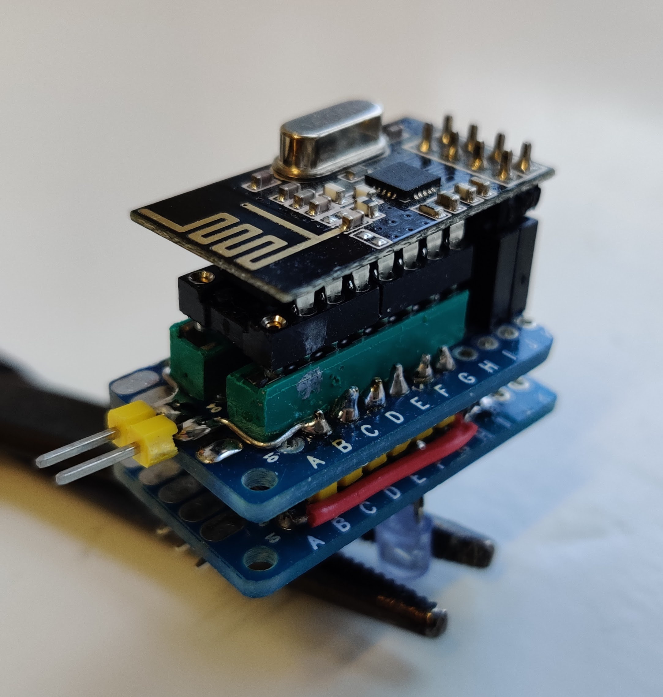

# DIY RC plane using the ATtiny44 with an nRF24L01 as a receiver

* With an old ESky 0404 35MHz 4 channel radio controller to hand,  use the training port to get the PPM signals decoded - Working
* Transmit the decoded PPM signals using one RX-Nano to another RX-Nano to test - Working
* Get ATtiny44 to receive the same signals - Working
* Get ATtiny to drive a servo motor - Working
* Create a circuit so the ATtiny can drive the tiny motors - Currently using a transistor, but will try using a mosfet to see if I can reduce the voltage drop.
* Get the BMP180 pressure sensor working with the ATtiny using soft I2C (SoftI2CMaster) - (because the SDA and SCL are being used for the nrf24l01) - to do later

With the latest update the PPM decoder and transmitter are working porperly.

Now I am lacking some power in the motor, so I will replace the 2N2222 with an K12N06L mosfet.

## The trasmitter
This is simply an RF-Nano powered by the radio's defual batteries, using a buck converter to convert the 12V to 5V. The signal has been obtained by soldering a wire to the signal pin on the inside of the trainer port, and connecting it to one of the arduino GPIOs.

## The receiver
This is an ATtiny44 with an nRF24L01 powered by a 3.4v LiPo battery.
### The module

### Circuit diagram

## Refinements
Possibly use a library rather, to decode the PPM signal, that does not make use of `micros()`

